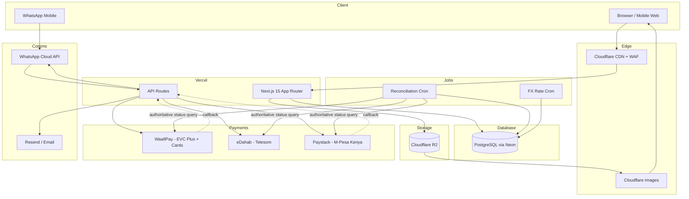
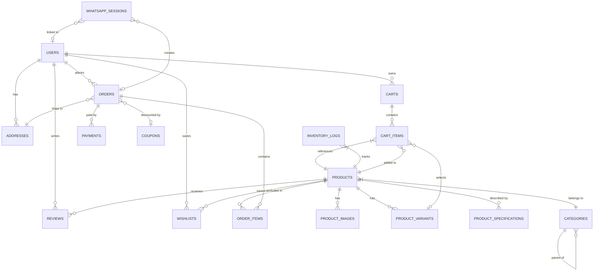
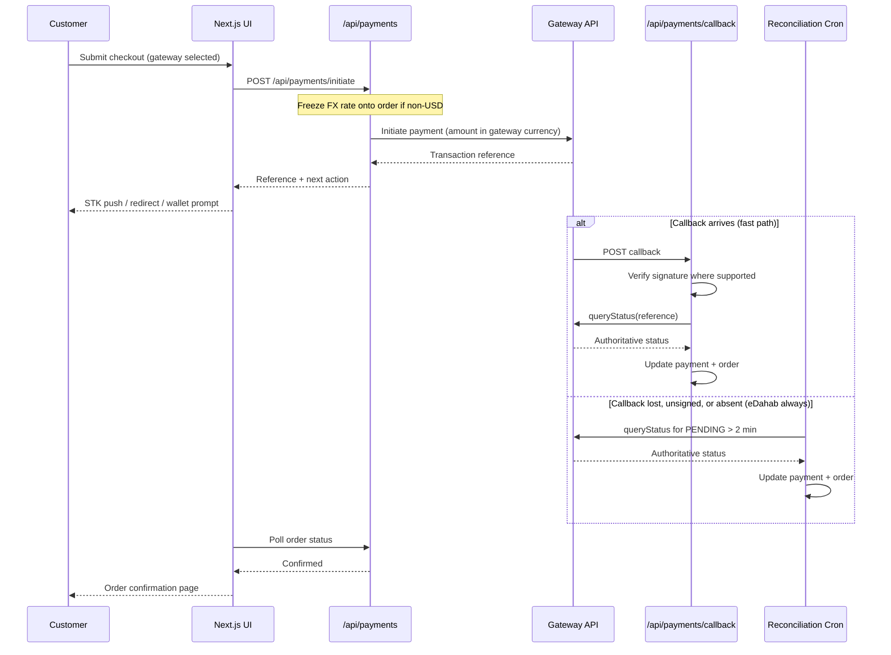
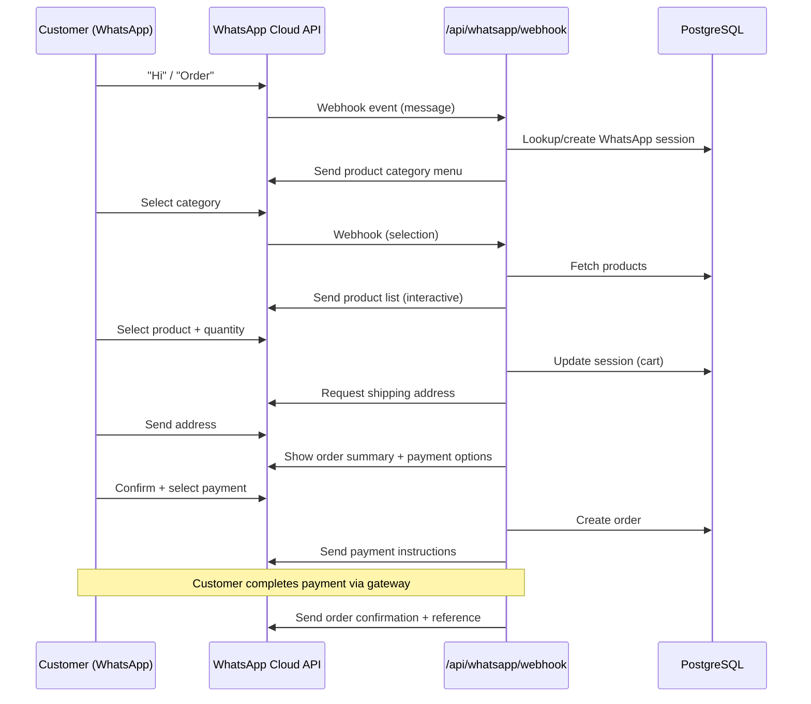

# HurbadHardware East Africa E-Commerce Platform - Plan

---

## Goal Capsule

- **Objective:** Build a production-ready electronics e-commerce platform serving Somalia, Kenya, and Ethiopia — covering the full product catalog, regional mobile-money and card checkout, customer accounts, admin dashboard, and WhatsApp ordering.
- **Authority:** This plan is the implementation source of truth. The implementing agent follows units in dependency order and surfaces genuine scope conflicts rather than guessing.
- **Execution profile:** Greenfield build across 8 sprints (~16 weeks). Each sprint maps to a phase of units below.
- **Stop conditions:** Stop and surface a blocker when: a regional payment gateway API is unreachable or undocumented; a Meta Business API approval is blocked; a scope decision changes more than one sprint's unit boundaries.
- **Tail ownership:** `ce-work` or equivalent executor owns sequencing within sprints. Admin analytics (U19) and deployment pipeline (U21) are the tail units — they close the build.

---

## Product Contract

### Summary

A multi-regional B2C electronics storefront for East Africa serving Somalia, Kenya, and Ethiopia. The platform enables product browsing and purchase across 8 categories, with checkout via 5 payment gateways, WhatsApp-based ordering, customer self-service, and an admin dashboard for catalog, inventory, and order management.

### Problem Frame

East African consumers lack a regional electronics retailer with localized payment support. Existing platforms do not integrate EVC Plus/eDahab (Somalia), M-Pesa (Kenya), or Telebirr (Ethiopia), forcing customers to abandon checkout. HurbadHardware fills this gap: a mobile-first, SEO-optimized storefront with payment methods customers already use, in their language (English + Somali), on infrastructure that performs at East African network speeds.

### Requirements

**Product Catalog**

- R1. The catalog organizes products into 8 categories: Smartphones, Laptops, Tablets, Accessories, Networking Equipment, CCTV Systems, Printers, Computer Components.
- R2. Customers search products by keyword with full-text match across name, description, and brand.
- R3. Customers filter the catalog by category, brand, price range (USD), and availability.
- R4. Customers sort results by price (asc/desc), newest, average rating, and popularity.
- R5. Customers compare up to 3 products side-by-side on a shared specification table.
- R6. Product detail pages display an image gallery, variants (e.g., storage/color), and a specification sheet.
- R7. Authenticated customers submit star ratings (1–5) and text reviews on products they have purchased.

**Shopping**

- R8. Guest cart persists in the browser session; authenticated cart persists in the database and merges on login.
- R9. Authenticated customers maintain a wishlist (add/remove products).
- R10. Customers apply a single discount coupon code at checkout for a percentage or fixed-USD discount.

**Checkout**

- R11. Checkout collects a shipping address, validates stock availability, and calculates the order total before payment.
- R12. Checkout accepts EVC Plus payments (Somalia mobile money) via the WaafiPay gateway, charged in USD.
- R13. Checkout accepts eDahab payments (Somalia/Somaliland mobile money via Telesom) charged in USD.
- R14. Checkout accepts M-Pesa payments (Kenya) routed through Paystack, charged in KES.
- R15. *(Deferred to v2 — see Scope Boundaries.)* Checkout accepts Telebirr payments (Ethiopia).
- R16. Checkout accepts Visa and Mastercard payments through WaafiPay's card rail, charged in USD.
- R17. All prices are stored and displayed in USD. Gateways that do not accept USD are charged in their required currency, converted at checkout from the USD base price.
- R35. When a gateway requires a non-USD currency, checkout displays the converted amount and the applied exchange rate to the customer before payment is authorized.
- R36. Every payment is confirmed by a server-side status query against the gateway before the order is marked paid. A browser redirect or an unverified callback never alone marks an order paid.

**Customer Accounts**

- R18. Customers register with email and password; Google OAuth is supported.
- R19. The customer dashboard shows order history, saved addresses, profile settings, and wishlist.
- R20. Order tracking shows the current status (Placed → Processing → Shipped → Delivered) with timestamps.

**WhatsApp Ordering**

- R21. Customers initiate orders by messaging the business WhatsApp number; the bot guides them through product selection, quantity, shipping address, and payment method.
- R22. The WhatsApp flow confirms the order total before final submission and creates an order record identical to web checkout.
- R23. The platform sends WhatsApp messages for order confirmation and each status change.

**Admin Dashboard**

- R24. Admins create, edit, and deactivate products including variants, images, and specifications.
- R25. Admins manage the category hierarchy (create, rename, reorder, nest).
- R26. Admins view and adjust inventory levels per product/variant; the system alerts when stock falls below a configurable threshold.
- R27. Admins view all orders, update order status, and add fulfillment notes.
- R28. Admins create, configure, and deactivate discount coupons (percent or fixed, expiry, usage cap).
- R29. Admin analytics surface total revenue, order volume, top-selling products, and daily/weekly/monthly trends.

**Platform**

- R30. All storefront pages are mobile-responsive using a mobile-first CSS approach.
- R31. The UI renders in English and Somali; the customer selects language and the preference persists.
- R32. Product and category pages are server-side rendered with canonical URLs, Open Graph meta tags, and JSON-LD structured data (Product schema).
- R33. An XML sitemap covering all products and categories is generated on build and revalidated on product change.
- R34. Product images are served through Cloudflare Images with responsive sizes and lazy loading.

### Key Decisions

- **KD1. USD base pricing with checkout-time conversion.** Governs R17, R35, and R12–R16. Prices are authored and stored once in USD; gateways that cannot accept USD are charged in their required currency at a rate fixed at checkout. Chosen over per-region local pricing, which would triple catalog price management for admins.
- **KD2. WhatsApp Business Cloud API.** Automated webhook-driven order flow, governs R21–R23. Click-to-chat alternative was rejected; it requires manual fulfillment.
- **KD3. English + Somali for v1.** Governs R31. Swahili and Amharic deferred to v2.
- **KD4. Ethiopia deferred from v1.** Governs R15. Telebirr's onboarding-gated sandbox, dual RSA padding schemes, and IP-allowlist requirement place it outside a v1 launch. Somalia and Kenya carry the launch.
- **KD5. Kenya routed through an aggregator, not direct Daraja.** Governs R14. Paystack activates in ~24 hours against Daraja's 2–6 weeks and settles in USD; the ~1.5% fee buys launch speed. The provider stays swappable so direct Daraja remains available once Kenya volume justifies it.
- **KD6. Card payments ride WaafiPay, not Stripe.** Governs R16. Stripe does not onboard merchants in Somalia, Kenya, or Ethiopia; WaafiPay carries card and bank alongside the Somali mobile rails in a single integration.

### Success Criteria

- Checkout completes successfully (payment captured, order created) for each active rail — EVC Plus, eDahab, WaafiPay cards, and M-Pesa via Paystack — in a staging environment.
- Every completed payment is confirmed by a server-side status query, not by a callback or redirect alone.
- A payment whose callback never arrives is still reconciled to the correct terminal state by the reconciliation job within 15 minutes.
- WhatsApp order flow creates a valid order record without admin intervention.
- Lighthouse mobile performance score ≥ 85 on the product listing page.
- All product and category pages render with correct JSON-LD and pass Google's Rich Results Test.
- Admin can adjust inventory and change order status within 3 UI interactions.

### Actors

- A1. **Guest** — unauthenticated visitor browsing the catalog, adding to cart.
- A2. **Customer** — authenticated buyer with an account, order history, and wishlist.
- A3. **WhatsApp Buyer** — customer interacting through WhatsApp rather than the web storefront.
- A4. **Admin** — staff member with full catalog, order, and analytics access.
- A5. **Payment Gateway** — external service (WaafiPay for EVC Plus and cards, eDahab, Paystack for M-Pesa) that processes payments and reports status by callback, redirect, or status query.

### Key Flows

- F1. **Web Checkout**
  - **Actors:** A1/A2, A5
  - **Steps:** Browse catalog → add to cart → apply coupon (optional) → enter address → select payment gateway → review converted amount and rate if non-USD → authenticate with gateway → server-side status query confirms → order confirmed.
  - **Covers:** R8, R10–R14, R16, R17, R35, R36.

- F2. **WhatsApp Order**
  - **Actors:** A3, A5
  - **Steps:** Customer messages WhatsApp number → bot presents menu → customer selects product and quantity → bot requests address → customer selects payment → bot initiates payment → payment callback → bot confirms order.
  - **Covers:** R21–R23.

- F3. **Admin Order Fulfillment**
  - **Actors:** A4
  - **Steps:** Admin views pending orders → updates status to Processing → marks Shipped with tracking → marks Delivered → customer receives WhatsApp/email notification at each step.
  - **Covers:** R27, R23.

### Scope Boundaries

**Deferred to Follow-Up Work (v2)**
- **Telebirr / Ethiopia market (R15).** Requires resolving three blockers first: Telebirr's sandbox is gated behind completed merchant KYC (no pre-onboarding evaluation possible), the API uses two different RSA padding schemes (PSS for the pre-order request, PKCS#1 for the redirect signature), and Telebirr requires source-IP allowlisting which Vercel serverless cannot satisfy without a static-egress proxy. Evaluate Flutterwave's Ethiopia coverage as a lower-cost entry before committing to direct integration.
- **Direct M-Pesa Daraja integration.** Paystack carries Kenya in v1. Migrate to direct Daraja when Kenya transaction volume makes the ~1.5% aggregator fee exceed the cost of owning the integration. U12's adapter interface keeps this swap contained to one adapter.
- **Stripe via a US entity (Stripe Atlas).** Only worth it if selling to buyers outside East Africa; WaafiPay covers cards for the target markets.
- Multi-language: Swahili, Amharic, Arabic UI translations.
- Seller/vendor marketplace (multi-vendor support).
- Native iOS/Android apps (mobile web only in v1).
- B2B pricing tiers and quote requests.
- Subscription / installment payment plans.
- Real-time inventory sync with external ERP or POS.
- Full-text search upgrade to Elasticsearch or Typesense.
- Product recommendation engine (ML-based).
- Loyalty/points program.
- Flash sales with countdown timers.

**Outside This Product's Identity**
- Logistics and courier integration (HurbadHardware handles fulfillment manually in v1).
- Marketplace seller onboarding and commission management.
- Crypto or BNPL payment methods.

---

## Planning Contract

### Key Technical Decisions

- KTD1. **Currency: USD base with gateway-boundary conversion** (session-settled: user-directed — chosen over per-region local pricing: keeps one authored price per product instead of three). Governs R17, R35. Prices are stored in USD. WaafiPay and eDahab are charged in USD natively. Paystack/M-Pesa is charged in integer KES, converted at checkout using a rate fetched and frozen onto the order at creation time, so the customer-quoted amount and the gateway-charged amount can never drift apart.
- KTD13. **Exchange rates from a cached daily snapshot, not per-request.** A scheduled job fetches USD→KES once per hour and stores it; checkout reads the stored rate rather than calling an FX API inline. This bounds checkout latency, survives FX-provider downtime, and makes the rate auditable per order. A configurable spread absorbs intra-hour drift; the business absorbs residual drift rather than re-charging the customer.
- KTD14. **Reconciliation polling is mandatory, not a fallback.** Governs R36. Each gateway fails the naive webhook model differently: WaafiPay does not retry failed webhook deliveries (a Vercel cold start loses the event permanently), eDahab has no server-to-server callback at all (only an attacker-controllable browser redirect), and M-Pesa callbacks are unsigned and can be delivered more than once. A scheduled reconciliation job queries gateway status for every `PENDING` payment older than 2 minutes and drives it to a terminal state. Callbacks are treated as a latency optimization, never as the source of truth.
- KTD2. **WhatsApp: Meta Cloud API with webhooks** (session-settled: user-directed — chosen over click-to-chat deeplinks: enables automated order capture without manual fulfillment). Governs R21–R23. Requires Meta Business Portfolio verification and a WhatsApp Business phone number.
- KTD3. **Languages: English + Somali via `next-intl`** (session-settled: user-directed — chosen over English-only: primary market coverage). Governs R31. Translation keys use structured JSON under `messages/en.json` and `messages/so.json`. Route pattern: `/[locale]/...` with middleware locale detection.
- KTD4. **Next.js 15 App Router with React Server Components.** Product and category pages use SSR (`fetch` with `revalidate`) for SEO; interactive client components (cart, filters, search) are isolated. Governs R30, R32.
- KTD5. **NextAuth.js v5 (Auth.js) with Prisma adapter.** Email/password with bcrypt; Google OAuth provider; JWT sessions; middleware-based route protection for `/account` and `/admin`. Governs R18.
- KTD6. **Unified payment gateway abstraction over genuinely dissimilar rails.** A `PaymentGateway` interface with `initiatePayment`, `queryStatus`, and `validateCallback`, implemented by three v1 adapters (WaafiPay, eDahab, Paystack). The abstraction is deliberately thin: the four rails share almost no auth paradigm — WaafiPay embeds credentials in the request body, eDahab signs with a SHA-256 hash of the raw body passed as a query param, Paystack uses a bearer secret key. Only `queryStatus` is uniform across all three, which is why KTD14 makes it the authority. Governs R12–R14, R16.
- KTD7. **PostgreSQL full-text search via `tsvector`.** A generated `search_vector` column on `products` populated from `name_en`, `name_so`, `description_en`, and `brand`. Adequate for catalog scale without a dedicated search service. Governs R2.
- KTD8. **Cloudflare R2 + Cloudflare Images for media.** Product image uploads go to R2; Cloudflare Images delivers responsive transforms. `next/image` uses Cloudflare Images as the loader. Governs R34.
- KTD9. **Prisma ORM with PostgreSQL (Neon or Supabase for managed hosting).** All DB access via Prisma Client; migrations via `prisma migrate`. Connection pooling via PgBouncer (Neon/Supabase provides this out of the box).
- KTD10. **Zustand for client-side cart and wishlist state.** Server state (orders, products) via React Server Components + `fetch`; ephemeral UI state (cart count, wishlist toggle) via Zustand store with localStorage persistence for guests. Governs R8, R9.
- KTD11. **Admin dashboard at `/admin` with server-side RBAC.** NextAuth middleware checks `user.role === 'ADMIN'` on every `/admin` route. Admin UI built with shadcn/ui components. No separate admin app. Governs R24–R29.
- KTD12. **Email via Resend (or SendGrid).** Transactional emails (order confirmation, status updates) via Resend API. Falls back to SendGrid if Resend unavailable. Governs R20, R23.

### High-Level Technical Design

#### System Architecture



#### Database Entity Relationships



#### Payment Flow (Sequence)

Callbacks accelerate confirmation; the status query decides it (KTD14).



#### WhatsApp Order Flow (Sequence)



#### Database Schema (Core Tables)

```sql
-- Key columns only; full Prisma schema in prisma/schema.prisma

users          (id, email, phone, name, password_hash, role ENUM[CUSTOMER,ADMIN],
                country, locale ENUM[en,so], google_id, created_at)

addresses      (id, user_id, full_name, phone, address_line1, address_line2,
                city, state, country ENUM[SO,KE,ET], is_default)

categories     (id, name_en, name_so, slug, parent_id, image_url,
                sort_order, is_active)

products       (id, name_en, name_so, slug, description_en, description_so,
                brand, sku, base_price_usd DECIMAL(10,2), stock_quantity INT,
                category_id, is_active, is_featured,
                search_vector TSVECTOR GENERATED)

product_images (id, product_id, url, alt_en, alt_so, position, is_primary)

product_specs  (id, product_id, key_en, key_so, value_en, value_so, sort_order)

product_variants(id, product_id, name, sku, price_usd DECIMAL(10,2),
                 stock_quantity, attributes JSONB, is_active)

reviews        (id, product_id, user_id, rating SMALLINT, title, body,
                is_verified_purchase, is_approved, created_at)

carts          (id, user_id, session_id, created_at, updated_at)
cart_items     (id, cart_id, product_id, variant_id, quantity)

wishlists      (id, user_id, product_id, created_at)

coupons        (id, code, type ENUM[PERCENT,FIXED], value DECIMAL(10,2),
                min_order_usd, max_uses, used_count, expires_at, is_active)

orders         (id, user_id, status ENUM[PLACED,PROCESSING,SHIPPED,DELIVERED,CANCELLED],
                subtotal_usd, discount_usd, tax_usd, total_usd,
                charge_currency ENUM[USD,KES], charge_amount DECIMAL(12,2),
                fx_rate DECIMAL(14,6), fx_rate_at TIMESTAMP,
                shipping_address_id, coupon_id, payment_method, payment_status,
                is_whatsapp_order, notes, created_at)

order_items    (id, order_id, product_id, variant_id, quantity,
                unit_price_usd, name_snapshot_en, name_snapshot_so)

payments       (id, order_id, gateway ENUM[WAAFIPAY,EDAHAB,PAYSTACK],
                method ENUM[EVC_PLUS,EDAHAB,CARD,MPESA],
                gateway_reference, gateway_transaction_id,
                amount_usd DECIMAL(10,2), charge_amount DECIMAL(12,2), charge_currency,
                status ENUM[PENDING,COMPLETED,FAILED,EXPIRED],
                callback_payload JSONB, last_polled_at TIMESTAMP, poll_attempts INT,
                created_at, UNIQUE(gateway, gateway_reference))

fx_rates       (id, base ENUM[USD], quote ENUM[KES], rate DECIMAL(14,6),
                spread_pct DECIMAL(5,3), source, fetched_at)

whatsapp_sessions(id, wa_phone_id, from_phone, user_id, order_id,
                  state TEXT, context JSONB, last_message_at, created_at)

inventory_logs (id, product_id, variant_id, delta INT, reason TEXT,
                created_by, created_at)
```

### Assumptions

- **WaafiPay production base URL must be confirmed with the account manager before go-live.** The official docs give `https://api.waafipay.net/asm` while a widely-cited community guide gives `https://api.waafipay.com/asm`. These disagree and the plan does not resolve which is correct.
- **eDahab has no documented sandbox.** The vendor's own quick-start describes testing against production, where "the deducted amount will go to your registered merchant." Assume U12 testing spends real money on eDahab unless Telesom confirms a test mode; budget a small float and use minimum-value transactions.
- Merchant onboarding is on the critical path and is not a coding task. WaafiPay requires **in-person registration at a WAAFI office in Somalia**; Paystack activates in ~24 hours with business registration documents; eDahab requires an approved merchant account plus an Agent configured in the dashboard, and Telesom advertises a one-time $100 API application fee for its e-payment products. Start onboarding before Sprint 1, not at Sprint 4.
- WhatsApp Business API approval from Meta is obtained before U16 begins; Cloud API (hosted by Meta) is used, not the On-Premises API.
- An FX rate source (exchangerate.host, Open Exchange Rates, or equivalent) is available for USD→KES. The specific provider is an implementation choice in U22.
- SMTP/email is handled by Resend; if unavailable, SendGrid is the fallback (same interface pattern).
- Product media upload size is ≤ 10 MB per image; Cloudflare Images handles resizing.
- A managed PostgreSQL provider (Neon or Supabase) is selected for connection pooling; implementer sets `DATABASE_URL` in Vercel environment.

---

## Implementation Units

### Unit Index

| U-ID | Title | Key Files | Depends On |
|---|---|---|---|
| U1 | Project Scaffolding | `package.json`, `next.config.ts`, `prisma/schema.prisma` | — |
| U2 | Database Schema & Migrations | `prisma/schema.prisma`, `prisma/seed.ts` | U1 |
| U3 | Authentication System | `src/lib/auth.ts`, `src/app/api/auth/`, `src/app/(auth)/` | U2 |
| U4 | i18n Foundation | `src/middleware.ts`, `messages/*.json`, `src/app/[locale]/` | U1 |
| U5 | Product Data Layer | `src/lib/products.ts`, `src/app/api/products/` | U2 |
| U6 | Product Catalog UI | `src/app/[locale]/(storefront)/products/`, `src/components/catalog/` | U4, U5 |
| U7 | Product Detail Page | `src/app/[locale]/(storefront)/products/[slug]/`, `src/components/product/` | U6 |
| U8 | Category Navigation | `src/app/[locale]/(storefront)/category/[slug]/`, `src/components/navigation/` | U5, U4 |
| U9 | Cart, Wishlist, Comparison | `src/store/cartStore.ts`, `src/app/api/cart/`, `src/app/[locale]/(storefront)/cart/` | U3, U5 |
| U10 | Reviews & Coupons | `src/lib/reviews.ts`, `src/lib/coupons.ts`, `src/app/api/reviews/` | U3, U5 |
| U22 | Currency & FX Layer | `src/lib/currency/`, `src/app/api/cron/fx-rates/` | U2 |
| U11 | Checkout Flow | `src/app/[locale]/(storefront)/checkout/`, `src/lib/orders.ts` | U9, U10, U22 |
| U12 | Payment Gateway Adapters | `src/lib/payments/`, `src/app/api/payments/` | U11, U22 |
| U23 | Payment Reconciliation | `src/lib/payments/reconcile.ts`, `src/app/api/cron/reconcile/` | U12 |
| U14 | Customer Account Dashboard | `src/app/[locale]/account/` | U3, U11 |
| U15 | Order Tracking & Notifications | `src/lib/notifications.ts`, `src/app/[locale]/track/` | U11, U12, U23 |
| U16 | WhatsApp Business API | `src/lib/whatsapp/`, `src/app/api/whatsapp/` | U11, U15 |
| U17 | Admin: Products & Inventory | `src/app/admin/products/`, `src/app/admin/inventory/` | U3, U5 |
| U18 | Admin: Order Management | `src/app/admin/orders/` | U17, U15 |
| U19 | Admin: Analytics Dashboard | `src/app/admin/page.tsx`, `src/lib/admin/analytics.ts` | U18 |
| U20 | SEO Optimization | `src/app/sitemap.ts`, `src/lib/seo.ts`, per-page `generateMetadata` | U6, U7, U8 |
| U21 | Performance & Deployment | `next.config.ts`, `vercel.json`, `public/manifest.json` | U20, U16, U19 |

---

### U1. Project Scaffolding and Infrastructure Setup

**Goal:** Bootstrap the Next.js 15 project with all tooling, configuration, and environment setup so every subsequent unit can begin with a working foundation.

**Requirements:** Enables R30 (mobile-first CSS), R32 (SSR setup), R34 (Cloudflare Images config).

**Dependencies:** None.

**Files:**
- `package.json`
- `next.config.ts`
- `tsconfig.json`
- `.env.example`
- `.eslintrc.json`
- `prettier.config.js`
- `tailwind.config.ts`
- `prisma/schema.prisma` (empty model placeholder)
- `src/lib/db.ts` (Prisma client singleton)
- `vercel.json`

**Approach:**
1. Scaffold with `create-next-app@latest` — App Router, TypeScript, Tailwind CSS, ESLint.
2. Install core dependencies: `prisma`, `@prisma/client`, `next-auth@beta`, `next-intl`, `zustand`, `@cloudflare/next-on-pages`, `shadcn/ui`.
3. Configure `next.config.ts` with Cloudflare Images loader and `experimental.serverActions`.
4. Add `src/lib/db.ts` as the Prisma singleton (prevents multiple client instances in dev).
5. Create `.env.example` documenting every required env var (see below).
6. Configure `vercel.json` with Node.js 20 runtime and function region (`fra1` for EU/Africa latency).

**Environment variables (`.env.example`):**
```
DATABASE_URL=
NEXTAUTH_SECRET=
NEXTAUTH_URL=
GOOGLE_CLIENT_ID=
GOOGLE_CLIENT_SECRET=
CLOUDFLARE_ACCOUNT_ID=
CLOUDFLARE_R2_BUCKET=
CLOUDFLARE_IMAGES_TOKEN=
CLOUDFLARE_IMAGES_ACCOUNT_HASH=
WAAFIPAY_BASE_URL=
WAAFIPAY_MERCHANT_UID=
WAAFIPAY_API_USER_ID=
WAAFIPAY_API_KEY=
WAAFIPAY_WEBHOOK_SECRET=
EDAHAB_BASE_URL=
EDAHAB_API_KEY=
EDAHAB_API_SECRET=
EDAHAB_AGENT_CODE=
PAYSTACK_SECRET_KEY=
PAYSTACK_PUBLIC_KEY=
FX_PROVIDER_API_KEY=
FX_SPREAD_PCT=
CRON_SECRET=
WHATSAPP_ACCESS_TOKEN=
WHATSAPP_PHONE_NUMBER_ID=
WHATSAPP_WEBHOOK_VERIFY_TOKEN=
RESEND_API_KEY=
```

**Test expectation:** None — scaffolding unit. Verify with `next build` succeeding and `prisma generate` completing without errors.

**Verification:** `next build` exits 0; `npx prisma generate` exits 0; linter passes on empty codebase.

---

### U2. Database Schema and Migrations

**Goal:** Define the complete Prisma schema, generate and apply migrations, and seed the database with categories and sample products.

**Requirements:** All data-layer requirements (R1, R8, R9, R12–R17, R18–R20, R21–R23, R24–R29).

**Dependencies:** U1.

**Files:**
- `prisma/schema.prisma`
- `prisma/migrations/` (generated)
- `prisma/seed.ts`
- `src/types/database.ts` (re-exported Prisma types)

**Approach:**
1. Define all models per the schema in Planning Contract: `User`, `Address`, `Category`, `Product`, `ProductImage`, `ProductSpecification`, `ProductVariant`, `Review`, `Cart`, `CartItem`, `Wishlist`, `Coupon`, `Order`, `OrderItem`, `Payment`, `WhatsAppSession`, `InventoryLog`.
2. Add `search_vector` as an `Unsupported("tsvector")` field on `Product` with a raw migration adding the `GENERATED ALWAYS AS (to_tsvector(...))` computed column and GIN index.
3. Add `@@index` decorators for frequent query patterns: `Product.categoryId`, `Product.isActive`, `Order.userId`, `Order.status`, `Payment.orderId`.
4. Seed: 8 root categories, 5 sample products per category with 2 images each, 1 admin user (`admin@hurbad.com`), 2 test coupons.

**Test scenarios:**
- Seed runs without FK violations; all 8 categories created.
- `prisma migrate status` shows all migrations applied.
- `Product.findMany({ where: { isActive: true }})` returns seeded products.
- Full-text search: raw query `SELECT * FROM products WHERE search_vector @@ to_tsquery('english', 'laptop')` returns laptop products.
- Cascade delete: deleting a `Product` cascades to `ProductImage` and `ProductSpecification`.

**Verification:** `npx prisma db push` or `migrate deploy` exits 0; seed script exits 0; spot-check category count in Prisma Studio.

---

### U3. Authentication System

**Goal:** Implement NextAuth.js v5 with email/password and Google OAuth, session handling, and RBAC middleware.

**Requirements:** R18 (customer registration/login); R24–R28 (admin route protection).

**Dependencies:** U2.

**Files:**
- `src/lib/auth.ts` (NextAuth config)
- `src/lib/auth-utils.ts` (helpers: `getCurrentUser`, `requireAdmin`)
- `src/app/api/auth/[...nextauth]/route.ts`
- `src/app/(auth)/login/page.tsx`
- `src/app/(auth)/register/page.tsx`
- `src/app/(auth)/register/actions.ts` (server action for registration)
- `src/middleware.ts` (add auth route matchers)
- `src/components/auth/LoginForm.tsx`
- `src/components/auth/RegisterForm.tsx`

**Approach:**
1. Configure NextAuth v5 with Prisma adapter using `@auth/prisma-adapter`.
2. Add `Credentials` provider (bcrypt password hash/verify) and `Google` provider.
3. Add `role` to the JWT session via `callbacks.session` so `session.user.role` is available client-side.
4. In `src/middleware.ts`, add matchers: redirect unauthenticated users from `/account/**` to `/login`; redirect non-ADMIN users from `/admin/**` to `/`.
5. Registration server action hashes password with `bcrypt` (cost 12) and creates `User` with `role: CUSTOMER`.

**Test scenarios:**
- Happy path: register with email/password → redirected to account dashboard.
- Happy path: login with Google → session created with role `CUSTOMER`.
- Edge case: duplicate email registration returns `EMAIL_TAKEN` error message.
- Error path: wrong password returns generic `Invalid credentials` (no email enumeration).
- RBAC: customer accessing `/admin` redirects to `/`.
- RBAC: admin accessing `/admin` renders dashboard.
- Session: JWT contains `id`, `email`, `role`; no password hash in token.

**Verification:** Manual login and registration flows succeed; `/admin` redirects unauthenticated; Prisma confirms `User` row with hashed password.

---

### U4. i18n Foundation

**Goal:** Configure `next-intl` for English and Somali with locale routing, middleware detection, and translation file structure.

**Requirements:** R31 (English + Somali UI).

**Dependencies:** U1.

**Files:**
- `src/i18n.ts`
- `src/middleware.ts` (merge with auth middleware)
- `messages/en.json`
- `messages/so.json`
- `src/app/[locale]/layout.tsx` (root locale layout)
- `src/app/[locale]/page.tsx` (redirect to `/[locale]/products`)
- `src/components/LanguageSwitcher.tsx`

**Approach:**
1. Configure `next-intl` with `createNextIntlPlugin` in `next.config.ts`.
2. Middleware: detect locale from `Accept-Language` header (preferred) or cookie; default to `en`; redirect `/` to `/en` or `/so`.
3. Create `messages/en.json` and `messages/so.json` with top-level namespaces: `common`, `nav`, `product`, `cart`, `checkout`, `account`, `admin`.
4. `LanguageSwitcher` client component switches locale by navigating to `/${newLocale}${currentPath}`.
5. All product `name`, `description`, and spec fields use the `[locale]` suffix convention already in schema (`name_en`, `name_so`); a `useLocaleField` hook returns the correct column key.

**Test scenarios:**
- Browser with `Accept-Language: so` visits `/` → redirected to `/so`.
- Switching language from EN to SO updates all visible strings without page reload.
- `useTranslations('product')('addToCart')` returns `"Add to Cart"` in EN and `"Ku dar Dambiisha"` in SO.
- Missing translation key falls back to English (next-intl default behavior).

**Verification:** `/en/products` and `/so/products` both render; language switcher toggles visible text.

---

### U5. Product Data Layer

**Goal:** Build the server-side data access functions for product catalog queries (listing, search, filter, sort, detail lookup).

**Requirements:** R1–R4, R6.

**Dependencies:** U2.

**Files:**
- `src/lib/products.ts`
- `src/lib/categories.ts`
- `src/app/api/products/route.ts`
- `src/app/api/products/[slug]/route.ts`
- `src/app/api/categories/route.ts`

**Approach:**
1. `getProducts(params)` in `src/lib/products.ts` accepts `{ search?, categorySlug?, brand?, minPrice?, maxPrice?, inStock?, sort?, page?, pageSize? }` and returns `{ products, total, page }`. Uses Prisma `findMany` with `where`, `orderBy`, and `skip`/`take`.
2. For `search`: when `search` is provided, append a Prisma raw query condition: `WHERE search_vector @@ plainto_tsquery('english', ${search})`.
3. `getProductBySlug(slug, locale)` returns product with images, specs, and variants; selects `name_en`/`name_so` based on locale.
4. `getCategories()` returns tree structure (recursive fetch of parent/children).
5. Expose as Next.js Route Handlers with `revalidate = 60` for CDN caching.

**Test scenarios:**
- `getProducts({})` returns paginated products (default page size 24).
- `getProducts({ search: 'samsung' })` returns products with Samsung in name or description.
- `getProducts({ categorySlug: 'smartphones', sort: 'price_asc' })` returns smartphones ordered by price.
- `getProducts({ inStock: true })` excludes `stock_quantity: 0` products.
- `getProductBySlug('galaxy-s25', 'so')` returns `name_so` for Somali locale.
- Edge case: `getProducts({ minPrice: 1000, maxPrice: 500 })` returns empty array (invalid range).
- `getCategories()` returns nested tree with parent/child relationships.

**Verification:** API routes respond with correct shape; Prisma query log shows expected SQL.

---

### U6. Product Catalog UI

**Goal:** Build the product listing page with search bar, filters sidebar, sort dropdown, pagination, and product cards.

**Requirements:** R1–R4, R30, R31.

**Dependencies:** U4, U5.

**Files:**
- `src/app/[locale]/(storefront)/products/page.tsx` (Server Component)
- `src/app/[locale]/(storefront)/products/loading.tsx`
- `src/components/catalog/ProductCard.tsx`
- `src/components/catalog/ProductGrid.tsx`
- `src/components/catalog/FiltersSidebar.tsx` (Client Component)
- `src/components/catalog/SortDropdown.tsx` (Client Component)
- `src/components/catalog/SearchBar.tsx` (Client Component)
- `src/components/catalog/Pagination.tsx`

**Approach:**
1. `products/page.tsx` is a Server Component that reads search params from `searchParams` prop and calls `getProducts()` server-side; no client fetch.
2. `FiltersSidebar` manages filter state in URL query params via `useRouter().push` so filters are bookmarkable and shareable.
3. `SearchBar` debounces input (300 ms) before updating the URL `q` param.
4. `ProductCard` shows: primary image (Cloudflare Images responsive), name (locale), price in USD, star rating badge, Add to Cart button.
5. Skeleton loading state via `loading.tsx` during SSR transitions.
6. Mobile: filters collapse into a slide-over drawer; grid switches from 2-column to 1-column below 640 px.

**Test scenarios:**
- Page renders 24 product cards on load with no search params.
- Typing "laptop" in search and waiting 300 ms updates the product grid to laptop results.
- Applying "Brand: Samsung" filter reduces results to Samsung products; URL contains `brand=Samsung`.
- Sort by "Price: Low to High" reorders cards by ascending price.
- Navigating to page 2 via pagination shows the next set of products.
- Mobile viewport (375 px): filter button opens drawer; cards render in 2-column grid.
- Locale `so`: product names display in Somali.

**Patterns to follow:** Tailwind CSS, shadcn/ui `Sheet` for mobile filter drawer, `next/image` for product images.

**Verification:** All filter/sort/search combinations produce correct results; no hydration errors in browser console.

---

### U7. Product Detail Page

**Goal:** Build the product detail page with image gallery, variant selector, specifications table, comparison add, and add-to-cart/wishlist actions.

**Requirements:** R5, R6, R7 (review display), R9 (wishlist button).

**Dependencies:** U6.

**Files:**
- `src/app/[locale]/(storefront)/products/[slug]/page.tsx`
- `src/app/[locale]/(storefront)/products/[slug]/loading.tsx`
- `src/components/product/ImageGallery.tsx` (Client Component)
- `src/components/product/VariantSelector.tsx` (Client Component)
- `src/components/product/SpecificationsTable.tsx`
- `src/components/product/CompareButton.tsx` (Client Component)
- `src/components/product/ReviewList.tsx`
- `src/components/product/AddToCartButton.tsx` (Client Component)
- `src/components/product/WishlistButton.tsx` (Client Component)
- `src/app/[locale]/(storefront)/compare/page.tsx`
- `src/store/compareStore.ts`

**Approach:**
1. Page is a Server Component; `generateStaticParams` pre-builds all product slugs at build time with ISR.
2. `generateMetadata` returns `title`, `description`, and JSON-LD `Product` schema (see U20 for full SEO treatment).
3. `ImageGallery`: main image with thumbnail strip; click/swipe changes main image; supports pinch-zoom on mobile.
4. `VariantSelector`: clicking a variant (e.g., "256 GB") updates the displayed price and stock status in UI state.
5. `CompareButton` adds product to `compareStore` (max 3); compare page renders side-by-side spec table.
6. `AddToCartButton` dispatches to cart server action (U9).
7. Reviews section fetches approved reviews; shows average rating and rating distribution bar.

**Test scenarios:**
- Page renders with correct product name in active locale.
- Selecting a variant updates price display; selecting out-of-stock variant disables Add to Cart.
- Adding 3 products to compare, then clicking Compare navigates to `/compare` with 3-column table.
- Adding a 4th product to compare replaces the oldest (FIFO).
- `WishlistButton` fills/unfills based on wishlist state; redirects to login if unauthenticated.
- JSON-LD `Product` schema is present in `<head>` (verified via `document.querySelector('script[type="application/ld+json"]')`).

**Verification:** `generateStaticParams` builds all product paths; Google Rich Results Test passes on a product page.

---

### U8. Category Navigation

**Goal:** Build the category navigation bar and category landing pages with SEO-friendly URLs.

**Requirements:** R1, R30, R32.

**Dependencies:** U5, U4.

**Files:**
- `src/app/[locale]/(storefront)/category/[slug]/page.tsx`
- `src/components/navigation/CategoryNav.tsx`
- `src/components/navigation/MobileNav.tsx` (hamburger menu)
- `src/components/navigation/Breadcrumb.tsx`

**Approach:**
1. `CategoryNav` renders top-level categories as a horizontal tab bar on desktop; collapses to hamburger menu on mobile.
2. Clicking a category navigates to `/[locale]/category/[slug]`; the page calls `getProducts({ categorySlug })` and reuses the `ProductGrid` from U6.
3. `Breadcrumb` renders the category path (Home → Smartphones) for SEO and navigation; uses `BreadcrumbList` JSON-LD.
4. Sub-categories rendered as a chip row below the page title.

**Test scenarios:**
- Desktop: all 8 category tabs visible in nav bar.
- Mobile (375 px): nav bar replaced by hamburger; opening menu shows all categories.
- `/category/smartphones` renders only smartphone products.
- Breadcrumb shows `Home > Smartphones`; breadcrumb JSON-LD present in head.

**Verification:** All 8 category pages render; breadcrumb JSON-LD validates in Rich Results Test.

---

### U9. Cart, Wishlist, and Product Comparison

**Goal:** Implement persistent cart (DB for authenticated, localStorage for guest), wishlist, and the product comparison store.

**Requirements:** R8, R9, per KTD10.

**Dependencies:** U3, U5.

**Files:**
- `src/store/cartStore.ts` (Zustand, localStorage persistence for guests)
- `src/lib/cart.ts` (server-side cart DB operations)
- `src/app/api/cart/route.ts` (GET, POST, DELETE)
- `src/app/[locale]/(storefront)/cart/page.tsx`
- `src/components/cart/CartItem.tsx`
- `src/components/cart/CartSummary.tsx`
- `src/components/layout/CartIcon.tsx` (header badge)
- `src/lib/wishlist.ts`
- `src/app/api/wishlist/route.ts`
- `src/store/compareStore.ts`

**Approach:**
1. Guest cart: Zustand store with `persist` middleware writing to `localStorage`.
2. Authenticated cart: server-side operations via `src/lib/cart.ts` (Prisma `Cart` + `CartItem`).
3. On login: `mergeCart` function reads guest cart items from `localStorage`, upserts them into the DB cart, and clears `localStorage`.
4. Cart API: `POST /api/cart` adds or increments; `DELETE /api/cart?itemId=` removes; `GET /api/cart` returns items with current prices (re-fetched from DB, not stored).
5. Wishlist: authenticated only; `POST /api/wishlist` adds; `DELETE /api/wishlist?productId=` removes.
6. Compare store: Zustand in-memory; max 3 products; exposed to `CompareButton` (U7).

**Test scenarios:**
- Guest adds product to cart; refreshes page; cart persists via `localStorage`.
- Guest logs in; cart items merge with any existing DB cart; `localStorage` cart cleared.
- Incrementing cart item quantity updates subtotal in `CartSummary`.
- Removing all items from cart shows empty cart state with CTA.
- Adding product to wishlist without auth redirects to login page.
- Authenticated user adds 3 products to wishlist; all 3 appear on `/account/wishlist`.
- Cart badge in header shows correct item count after add/remove.

**Verification:** Cart merge on login creates correct DB rows; wishlist API returns 401 for unauthenticated requests.

---

### U10. Reviews, Ratings, and Coupon System

**Goal:** Allow authenticated buyers to submit product reviews and validate discount coupon codes at checkout.

**Requirements:** R7, R10.

**Dependencies:** U3, U5.

**Files:**
- `src/lib/reviews.ts`
- `src/lib/coupons.ts`
- `src/app/api/reviews/route.ts` (POST, GET)
- `src/app/api/coupons/validate/route.ts`
- `src/components/reviews/ReviewForm.tsx` (Client Component)
- `src/components/reviews/StarRating.tsx`

**Approach:**
1. `POST /api/reviews`: verify user has a completed order containing the product (`is_verified_purchase`); enforce one review per user/product; set `is_approved: false` (admin approves or auto-approve per config).
2. `GET /api/reviews?productId=`: returns approved reviews, average rating, rating histogram.
3. `POST /api/coupons/validate`: accepts `{ code, subtotalUsd }`; checks code exists, not expired, usage below cap, and `min_order_usd` satisfied; returns `{ valid, type, value, discountUsd }`.
4. Average rating on `Product` is computed at read time via Prisma aggregate (not stored separately).

**Test scenarios:**
- Verified buyer submits 5-star review → created with `is_verified_purchase: true`.
- Non-buyer attempts review → API returns 403.
- Second review by same buyer on same product → API returns 409.
- Valid coupon `SAVE10` (10%, min $50 order) applied to $60 cart → discount is $6.
- Expired coupon returns `{ valid: false, reason: 'expired' }`.
- Coupon at usage cap returns `{ valid: false, reason: 'usage_limit_reached' }`.
- Coupon with `min_order_usd: 100` applied to $80 cart → `{ valid: false, reason: 'minimum_order_not_met' }`.

**Verification:** Review API enforces authentication; coupon validation returns correct discount amounts.

---

### U11. Checkout Flow

**Goal:** Build the multi-step checkout (address → shipping review → payment selection → order summary → confirmation) with server-side order creation.

**Requirements:** R11, R17, R35, per F1.

**Dependencies:** U9, U10, U22.

**Files:**
- `src/app/[locale]/(storefront)/checkout/page.tsx` (Client Component stepper)
- `src/app/[locale]/(storefront)/checkout/confirmation/page.tsx`
- `src/lib/checkout.ts` (validation, stock check)
- `src/lib/orders.ts` (createOrder, getOrder)
- `src/app/api/orders/route.ts`
- `src/components/checkout/AddressForm.tsx`
- `src/components/checkout/PaymentMethodSelector.tsx`
- `src/components/checkout/OrderSummary.tsx`

**Approach:**
1. Checkout is gated: redirect to login if unauthenticated.
2. Step 1 — Address: pre-fill saved addresses; allow new address entry; validate required fields.
3. Step 2 — Order Review: display cart items with current prices (re-fetched), applied coupon, total.
4. Step 3 — Payment: show available methods filtered by the shipping address country — EVC Plus, eDahab, and cards for Somalia; M-Pesa and cards for Kenya. Ethiopia shows cards only in v1 (Telebirr deferred, per KD4).
5. When the selected method charges in a non-USD currency, display the converted amount and the applied rate before the customer authorizes (R35). Call `convert()` from U22.
6. `POST /api/orders` creates an `Order` with status `PLACED` and a `Payment` with status `PENDING`, freezes `fx_rate`/`charge_amount`/`charge_currency` onto the order, and decrements stock — all in one Prisma transaction. Returns `orderId`.
7. After order creation, redirect to gateway initiation (U12); confirmation is driven by `queryStatus`, not by the redirect (R36). Land the customer on `/checkout/confirmation?orderId=`, which polls until terminal.

**Test scenarios:**
- Unauthenticated user at `/checkout` redirects to login; returns to checkout after login.
- Address form: missing required field prevents step progression.
- Stock check: checkout with quantity exceeding stock returns `INSUFFICIENT_STOCK` error.
- Gateway filter: shipping to Somalia shows EVC Plus + eDahab + cards; not M-Pesa.
- Gateway filter: shipping to Kenya shows M-Pesa + cards.
- Kenyan checkout displays an integer KES amount plus the applied rate before authorization.
- Order created atomically: stock decremented, order row inserted, payment row inserted, FX rate frozen — all in one transaction.
- Stale FX rate (older than 6 hours): Kenyan payment methods are hidden with an explanatory message; USD methods still work.
- Coupon discount reflected correctly in order total.
- Confirmation page shows order number, items, total, and estimated delivery.

**Verification:** Prisma transaction rolls back on any failure; order total matches cart total minus coupon discount.

---

### U22. Currency and FX Conversion Layer

**Goal:** Provide the USD→KES conversion used at the gateway boundary, with rates fetched on a schedule, stored, and frozen onto each order.

**Requirements:** R17, R35, per KTD1 and KTD13.

**Dependencies:** U2.

**Files:**
- `src/lib/currency/rates.ts`
- `src/lib/currency/convert.ts`
- `src/lib/currency/format.ts`
- `src/app/api/cron/fx-rates/route.ts`
- `vercel.json` (cron registration)

**Approach:**
1. `GET /api/cron/fx-rates` runs hourly via Vercel Cron; fetches USD→KES from the configured provider and inserts an `fx_rates` row. Never updates in place — the history is the audit trail.
2. `getRate('USD', 'KES')` returns the most recent row. If the newest row is older than 6 hours, it throws rather than silently using a stale rate; checkout surfaces this as "Kenyan payment temporarily unavailable" instead of charging a wrong amount.
3. `convert(amountUsd, 'KES')` applies the rate plus the configured spread, then **rounds up to a whole integer** — Daraja and Paystack's M-Pesa rail reject non-integer KES.
4. `formatMoney(amount, currency, locale)` renders currency per locale for display.
5. The route is protected by a `CRON_SECRET` bearer check so it cannot be triggered externally.

**Test scenarios:**
- Cron route inserts a new `fx_rates` row; the previous row is retained, not overwritten.
- `getRate` returns the newest row when several exist.
- `getRate` throws `StaleRateError` when the newest row is older than 6 hours.
- `convert(10.00, 'KES')` with rate 129.4 and 1.5% spread returns an integer, rounded up.
- `convert` on a USD-target gateway is an identity operation returning the original 2dp amount.
- Cron route without the `CRON_SECRET` bearer returns 401.

**Verification:** Two consecutive cron runs produce two rows; checkout for a Kenyan address shows an integer KES amount.

---

### U12. Payment Gateway Adapters

**Goal:** Implement the `PaymentGateway` interface and the three v1 adapters — WaafiPay (EVC Plus + cards), eDahab, and Paystack (M-Pesa Kenya).

**Requirements:** R12–R14, R16, R36, per KTD6.

**Dependencies:** U11, U22.

**Files:**
- `src/lib/payments/gateway.ts` (interface + factory)
- `src/lib/payments/waafipay.ts`
- `src/lib/payments/edahab.ts`
- `src/lib/payments/paystack.ts`
- `src/lib/payments/errors.ts`
- `src/app/api/payments/initiate/route.ts`
- `src/app/api/payments/callback/[gateway]/route.ts`
- `src/app/api/payments/status/[orderId]/route.ts`

**Approach:**

1. Define the interface. `queryStatus` is the authoritative method — `validateCallback` is optional because eDahab has no signed callback to validate:

```typescript
// directional guidance — not implementation specification
interface PaymentGateway {
  readonly chargeCurrency: 'USD' | 'KES'
  initiatePayment(p: InitiateParams): Promise<InitiateResult>
  queryStatus(reference: string): Promise<TerminalStatus>   // authority (KTD14)
  validateCallback?(rawBody: string, headers: Headers): boolean
}
```

2. **WaafiPay (EVC Plus + cards).** Single `POST /asm` endpoint dispatched by a `serviceName` field; credentials (`merchantUid`, `apiUserId`, `apiKey`) travel inside the request body under `serviceParams`. Charge in USD natively. Use `API_PREAUTHORIZE` rather than `API_PURCHASE` so a dropped connection can be cancelled cleanly instead of leaving an orphaned charge. Treat `responseCode: 2001` as *request accepted*, not *money moved* — read `params.state` for the real outcome. Amounts are truncated (not rounded) beyond 2dp, so reconcile against the returned amount rather than the sent amount.

3. **eDahab.** `POST /Issueinvoice?hash=<sha256hex>` where the hash is `SHA256(rawJsonBody + apiSecret)`. Build the JSON string **once**, hash that exact string, and transmit that same string — a second `JSON.stringify` or any client-library re-serialization breaks the signature. Charge in USD natively. There is no webhook: `CheckInvoiceStatus` is the only trustworthy confirmation. The browser `returnUrl` is a UI cue only.

4. **Paystack (M-Pesa Kenya).** Bearer secret key auth. Initialize a transaction with the KES integer amount from U22, `channels: ['mobile_money']`, and the customer's Kenyan MSISDN. Verify via `GET /transaction/verify/:reference`.

5. `POST /api/payments/callback/[gateway]` handles inbound callbacks. It **never trusts the payload**: it validates the signature where the gateway offers one (WaafiPay's `X-Webhook-Signature`, HMAC-SHA256 over `{timestamp}.{event_id}.{raw_body}`, constant-time compared), then calls `queryStatus` and writes the result of *that* call. Capture the raw request body before JSON parsing or signature validation cannot work.

6. `GET /api/payments/status/[orderId]` lets the checkout UI poll while waiting on a wallet prompt.

7. `UNIQUE(gateway, gateway_reference)` on `payments` makes duplicate callback delivery a no-op at the database level.

**Test scenarios:**
- `WaafiPayAdapter.initiatePayment` sends credentials in the body under `serviceParams`; returns a pending result with a reference.
- WaafiPay responds `responseCode: 2001` with `params.state: 'FAILED'` → adapter reports failure, not success.
- WaafiPay returns an amount truncated below the sent amount → reconciliation uses the returned amount.
- `EdahabAdapter` signs the exact transmitted body; re-serializing the payload before send produces a signature mismatch (guard test).
- eDahab returns `StatusCode: 5` (insufficient balance) → payment marked `FAILED`, stock restored.
- eDahab `returnUrl` hit with a forged success param → order stays `PENDING`; only `CheckInvoiceStatus` can complete it.
- `PaystackAdapter` sends an integer KES amount; a decimal amount is rejected before the API call.
- Valid WaafiPay callback signature → handler calls `queryStatus` and writes that result, not the callback body.
- Invalid callback signature → 401, DB unchanged.
- Same callback delivered twice → second insert violates the unique constraint and is absorbed; order updated once.
- `getGateway('PAYSTACK')` factory returns the Paystack adapter with `chargeCurrency: 'KES'`.

**Execution note:** Obtain credentials before writing adapters — WaafiPay has a usable sandbox, Paystack activates in ~24 hours, and eDahab has no documented sandbox (expect to test against live money with minimum-value transactions). Confirm the WaafiPay production base URL with the account manager; the published sources disagree between `.net` and `.com`.

**Verification:** Each adapter initiates a payment and reaches a correct terminal state via `queryStatus` in staging. A deliberately-dropped callback still resolves through U23.

---

### U23. Payment Reconciliation

**Goal:** Guarantee every payment reaches a correct terminal state regardless of whether its callback arrived, per KTD14.

**Requirements:** R36.

**Dependencies:** U12.

**Files:**
- `src/lib/payments/reconcile.ts`
- `src/app/api/cron/reconcile/route.ts`
- `src/app/admin/payments/page.tsx` (reconciliation visibility for admins)
- `vercel.json` (cron registration)

**Approach:**
1. `GET /api/cron/reconcile` runs every 2 minutes via Vercel Cron, protected by `CRON_SECRET`.
2. Selects `Payment` rows with `status = PENDING` and `created_at` older than 2 minutes, ordered oldest first, capped per run to stay inside the function timeout.
3. For each, calls the adapter's `queryStatus`; on a terminal result, updates the payment and its order inside one transaction, and triggers the U15 notification.
4. Records `last_polled_at` and increments `poll_attempts`. Backs off progressively; after 30 minutes with no terminal status, marks the payment `EXPIRED`, restores stock, and flags the order for admin review.
5. Stock restoration on failure/expiry is a compensating transaction — the same code path U12 uses on an explicit failure callback.
6. `/admin/payments` lists payments currently pending or expired so staff can see stuck money without database access.

**Test scenarios:**
- Payment pending 3 minutes with a gateway reporting success → marked `COMPLETED`, order `PROCESSING`, notification sent.
- Payment pending with gateway reporting failure → marked `FAILED`, stock restored to the exact prior quantity.
- Payment pending 31 minutes with the gateway still returning pending → marked `EXPIRED`, stock restored, order flagged.
- Payment already `COMPLETED` by a callback → skipped by the query, no duplicate notification.
- Callback and reconciliation racing on the same payment → transaction isolation means exactly one wins; the order is updated once.
- Gateway API unreachable → `poll_attempts` increments, payment stays `PENDING`, run does not abort for other payments.
- Cron route without `CRON_SECRET` returns 401.

**Execution note:** Write the race-condition test (callback and cron hitting one payment simultaneously) before the implementation — it is the defect this unit exists to prevent, and it is hard to retrofit confidence in afterwards.

**Verification:** With callbacks deliberately disabled in staging, a full checkout still reaches `COMPLETED`. Stock counts are unchanged after a failed-payment cycle.

---

### U14. Customer Account Dashboard

**Goal:** Build the customer self-service portal: profile, order history, address book, and wishlist.

**Requirements:** R18, R19, R20.

**Dependencies:** U3, U11.

**Files:**
- `src/app/[locale]/account/page.tsx` (redirect to `/account/orders`)
- `src/app/[locale]/account/orders/page.tsx`
- `src/app/[locale]/account/orders/[id]/page.tsx`
- `src/app/[locale]/account/profile/page.tsx`
- `src/app/[locale]/account/addresses/page.tsx`
- `src/app/[locale]/account/wishlist/page.tsx`
- `src/components/account/`

**Approach:**
1. All account pages are Server Components fetching user data server-side (no client fetch); protected via middleware (per U3).
2. `/account/orders` lists orders sorted by `created_at DESC` with status badge, total, and link to detail.
3. `/account/orders/[id]` shows order items, shipping address, payment method, and status timeline.
4. `/account/profile` allows updating name, phone, and locale preference; password change requires current password verification.
5. `/account/addresses` allows adding, editing, and deleting saved addresses; one default address.
6. `/account/wishlist` shows wishlist products with price and Add to Cart button.

**Test scenarios:**
- Unauthenticated request to `/account` redirects to login.
- Order list shows orders sorted newest first.
- Order detail shows correct items, quantities, and status timeline with timestamps.
- Updating locale to `so` on profile page and saving → next page load renders in Somali.
- Deleting default address when only one address exists shows error (must have at least one).

**Verification:** All account sub-pages render with correct user data; profile update reflects in the session.

---

### U15. Order Tracking and Notifications

**Goal:** Build the public order tracking page and implement email/WhatsApp notifications triggered by order status changes.

**Requirements:** R20, R23.

**Dependencies:** U11, U12, U23.

**Files:**
- `src/app/[locale]/track/[orderId]/page.tsx`
- `src/lib/notifications.ts`
- `src/lib/email.ts` (Resend wrapper)
- `src/lib/email-templates/order-confirmation.tsx`
- `src/lib/email-templates/status-update.tsx`

**Approach:**
1. `/track/[orderId]` renders publicly (no auth required) given a valid `orderId`; shows order status, items (without prices), and a timeline. To prevent enumeration, display only the last 4 chars of the order ID in the URL — verify the full UUID in the query.
2. `sendOrderNotification(orderId, event)` is the central notification dispatcher: sends email via Resend + WhatsApp via U16's `sendWhatsAppMessage` when the customer has a WhatsApp phone on file.
3. Email templates use React Email components for consistent HTML.
4. Notification triggers: `PLACED`, `PROCESSING`, `SHIPPED` (include tracking number if provided), `DELIVERED`.
5. Notifications are enqueued via a Vercel Cron function or triggered synchronously from admin order status update (U18).

**Test scenarios:**
- `/track/<validOrderId>` renders order status; last-4 of order ID matches URL.
- `/track/<invalidOrderId>` returns 404.
- Order placed → Resend API called with `order-confirmation` template → email contains order number and items.
- Order status changed to `SHIPPED` → email sent with status update template; WhatsApp message sent if phone on file.
- Missing `RESEND_API_KEY` env var → notification fails gracefully with error logged (order not rolled back).

**Verification:** Resend dashboard shows sent emails; WhatsApp test account receives status messages.

---

### U16. WhatsApp Business API Integration

**Goal:** Implement the conversational WhatsApp ordering flow using Meta Cloud API webhooks — product selection through to order creation and payment initiation.

**Requirements:** R21–R23, per KTD2.

**Dependencies:** U11, U15.

**Files:**
- `src/lib/whatsapp/client.ts` (Meta Cloud API wrapper)
- `src/lib/whatsapp/order-flow.ts` (state machine)
- `src/lib/whatsapp/message-templates.ts`
- `src/app/api/whatsapp/webhook/route.ts` (GET for verification, POST for messages)

**Approach:**
1. Webhook GET handler: responds to Meta's hub challenge verification.
2. Webhook POST handler: parses incoming messages, looks up or creates a `WhatsAppSession`, routes to `orderFlow.handleMessage(session, message)`.
3. `orderFlow` is a state machine with states: `IDLE → CATEGORY_SELECTION → PRODUCT_SELECTION → QUANTITY → ADDRESS → PAYMENT_SELECTION → CONFIRM → COMPLETED`.
4. At each state, the bot sends an interactive message (buttons or list reply) using the Meta Cloud API `/messages` endpoint.
5. `CONFIRM` state: bot renders order summary and "Confirm Order / Cancel" buttons.
6. On confirm: calls `createOrder` (same function as web checkout, per U11), initiates payment via the selected gateway, sends confirmation message via `sendWhatsAppMessage`.
7. `sendWhatsAppMessage(phone, message)` is the utility used by U15 for notifications.

**Test scenarios:**
- GET webhook with correct verify token → responds with hub.challenge.
- GET webhook with wrong verify token → returns 403.
- Incoming "Hi" message → bot responds with category list.
- Session state persists across multiple messages for the same phone number.
- User selects product with stock 0 → bot responds "Out of stock, choose another."
- User completes flow → `Order` and `Payment` rows created; bot sends confirmation with order ID.
- User sends "Cancel" during CONFIRM state → session reset; bot sends cancellation confirmation.
- Invalid phone number format in address step → bot prompts re-entry.
- WhatsApp notification for `SHIPPED` status change sent via `client.sendMessage`.

**Execution note:** Register the webhook URL in Meta Developer Console before testing. Outgoing messages require approved message templates for session initiation (if > 24 hours since last customer message).

**Verification:** Complete WhatsApp order flow creates a valid DB order; order appears in admin dashboard.

---

### U17. Admin: Product and Inventory Management

**Goal:** Build the admin interface for creating, editing, and deactivating products, managing categories, and adjusting inventory.

**Requirements:** R24–R26, per KTD11.

**Dependencies:** U3, U5.

**Files:**
- `src/app/admin/layout.tsx` (admin shell with sidebar nav)
- `src/app/admin/products/page.tsx`
- `src/app/admin/products/new/page.tsx`
- `src/app/admin/products/[id]/page.tsx`
- `src/app/admin/products/[id]/edit/page.tsx`
- `src/app/admin/categories/page.tsx`
- `src/app/admin/inventory/page.tsx`
- `src/components/admin/ProductForm.tsx` (Client Component)
- `src/components/admin/ImageUploader.tsx` (Client Component)
- `src/lib/admin/products.ts`
- `src/lib/admin/inventory.ts`

**Approach:**
1. All admin routes protected by `role === 'ADMIN'` middleware check (per U3).
2. `ProductForm` handles both create and edit with fields: name (EN + SO), description (EN + SO), category, brand, SKU, base price, stock quantity, variants (dynamic field array), specs (key-value pairs EN + SO), featured toggle, active toggle.
3. `ImageUploader` uploads files directly to Cloudflare R2 via a pre-signed URL obtained from `POST /api/admin/upload`; stores the R2 URL in `ProductImage`.
4. Inventory page: table of all products with current stock; inline quantity adjustment field; saves `InventoryLog` on change.
5. Low-stock alert: products with `stock_quantity ≤ threshold` (configurable, default 5) shown with red badge.
6. Category management: drag-to-reorder list; add child category; rename; deactivate.

**Test scenarios:**
- Admin creates new product with EN + SO names, 2 images, 3 specs → product appears in storefront after creation.
- Image upload: file uploaded to R2; `ProductImage` URL stored correctly.
- Admin edits product price → updated price reflected in storefront within 60 seconds (ISR revalidation).
- Admin deactivates product → product no longer appears in catalog for customers.
- Inventory adjustment: admin sets stock to 5 → `InventoryLog` entry created; product shows low-stock badge.
- Non-admin user accessing `/admin/products` → redirected to homepage.

**Verification:** Created product appears in public catalog; inventory log entries persist.

---

### U18. Admin: Order Management

**Goal:** Build the admin order management interface with status updates, fulfillment notes, and notification triggering.

**Requirements:** R27.

**Dependencies:** U17, U15.

**Files:**
- `src/app/admin/orders/page.tsx`
- `src/app/admin/orders/[id]/page.tsx`
- `src/lib/admin/orders.ts`
- `src/components/admin/OrderStatusSelect.tsx`

**Approach:**
1. Orders list: filterable by status, date range, payment method; sortable by date and total; paginated (50 per page).
2. Order detail: shows customer info, items with quantities, shipping address, payment record, status timeline.
3. `OrderStatusSelect`: dropdown to change order status; on change, calls `updateOrderStatus(orderId, newStatus)` which: updates `Order.status`, creates a timeline entry, calls `sendOrderNotification` (U15).
4. Admin can add a free-text fulfillment note (e.g., tracking number for Shipped status).
5. Bulk status update: select multiple orders → apply status to all.

**Test scenarios:**
- Admin changes order status from `PLACED` to `PROCESSING` → customer receives email and WhatsApp notification.
- Admin adds tracking number when setting status to `SHIPPED` → tracking number appears in customer notification.
- Bulk status update on 3 orders → all 3 updated; 3 customer notifications sent.
- Order list filtered by `status=PLACED` shows only placed orders.
- Searching by customer email filters order list correctly.

**Verification:** Status change triggers notification; DB shows updated status and timeline entry.

---

### U19. Admin: Analytics Dashboard

**Goal:** Build the admin home page with key revenue metrics, order volume, top-selling products, and time-range filtering.

**Requirements:** R29.

**Dependencies:** U18.

**Files:**
- `src/app/admin/page.tsx`
- `src/lib/admin/analytics.ts`
- `src/components/admin/charts/RevenueChart.tsx` (Client Component)
- `src/components/admin/charts/OrderVolumeChart.tsx` (Client Component)
- `src/components/admin/StatCard.tsx`

**Approach:**
1. `analytics.ts` provides Prisma aggregate queries:
   - `getTotalRevenue(from, to)`: sum of `Order.total_usd` where `payment_status = COMPLETED`.
   - `getOrderCount(from, to)`: count of orders by status.
   - `getTopProducts(limit, from, to)`: `OrderItem` grouped by `product_id`, summed by quantity.
   - `getRevenueByDay(from, to)`: daily revenue for chart.
2. Dashboard stat cards: Total Revenue (USD), Order Count, Average Order Value, Pending Orders.
3. Revenue chart: line chart of daily revenue for the selected period (7d / 30d / 90d).
4. Order volume chart: bar chart grouped by status.
5. Top 10 products table: product name, units sold, revenue.
6. All queries use `where: { createdAt: { gte: from, lte: to }}` with parameterized dates (no raw SQL for analytics).

**Test scenarios:**
- Default dashboard (last 30 days): revenue stat matches sum of completed order totals in DB.
- Switching to "Last 7 days" updates all stats and charts.
- Top products table shows products ordered by units sold (descending).
- Empty period (no orders): stats show $0 / 0 counts; chart renders empty state.

**Verification:** Revenue figure matches manual SQL aggregate; charts render without hydration errors.

---

### U20. SEO Optimization

**Goal:** Implement comprehensive SEO across all storefront pages: metadata API, JSON-LD structured data, sitemap, robots.txt, Open Graph, and canonical URLs.

**Requirements:** R32, R33.

**Dependencies:** U6, U7, U8.

**Files:**
- `src/app/sitemap.ts`
- `src/app/robots.ts`
- `src/lib/seo.ts`
- `src/app/[locale]/(storefront)/products/[slug]/opengraph-image.tsx`
- `generateMetadata` additions in all storefront page files

**Approach:**
1. `src/lib/seo.ts`: `buildProductMetadata(product, locale)` returns Next.js `Metadata` object with `title`, `description`, `openGraph`, `twitter`, `alternates.canonical`.
2. Each product page calls `generateMetadata` (async Server Component export) using `buildProductMetadata`.
3. JSON-LD: `Product` schema on product pages (name, image, offers.price, offers.priceCurrency = "USD", description, brand).
4. `BreadcrumbList` JSON-LD on category and product pages.
5. `src/app/sitemap.ts`: fetches all active products and categories from DB; returns `MetadataRoute.Sitemap` with `lastModified` and `changeFrequency`.
6. `src/app/robots.ts`: allows crawling of storefront; disallows `/admin` and `/api`.
7. Open Graph images: dynamic OG image generation via `ImageResponse` for product detail pages (shows product image + name).
8. `hreflang` tags: `alternates.languages` set to `{ en: '/en/products/[slug]', so: '/so/products/[slug]' }` on all localized pages.

**Test scenarios:**
- Product page: `<title>` contains product name; `<meta name="description">` contains product description excerpt.
- Product page: `<script type="application/ld+json">` present with `@type: Product` and USD offer.
- Sitemap (`/sitemap.xml`): valid XML; all active product slugs present; no inactive products.
- `/robots.txt`: `Disallow: /admin`; `Allow: /`.
- OG image endpoint (`/products/[slug]/opengraph-image`): returns a valid PNG response.
- `hreflang` links present on EN product page pointing to SO equivalent.

**Verification:** Google Rich Results Test passes for `Product` schema; sitemap validates at sitemap.xml.

---

### U21. Performance Optimization and Production Deployment

**Goal:** Tune Core Web Vitals, configure Cloudflare CDN, set up the Vercel deployment pipeline, and produce a Progressive Web App manifest.

**Requirements:** R30, R34.

**Dependencies:** U20, U16, U19.

**Files:**
- `next.config.ts` (final image domains, bundle analyzer)
- `vercel.json` (function config, headers, redirects)
- `public/manifest.json` (PWA manifest)
- `public/sw.js` (service worker — optional, offline shell)
- `.github/workflows/ci.yml` (lint + type-check + build on PR)

**Approach:**
1. **Cloudflare CDN:** All static assets served via Cloudflare's edge network automatically (Vercel's Cloudflare integration or proxied via Cloudflare). Set `Cache-Control: public, max-age=31536000, immutable` on `/_next/static/`.
2. **Cloudflare Images loader:** Confirm `next.config.ts` loader function transforms Next.js image URLs to Cloudflare Images delivery URLs with `?w=`, `?h=`, `?f=auto`.
3. **Bundle optimization:** Enable `@next/bundle-analyzer`; identify and code-split any client-side component ≥ 50 kB; lazy-load `@stripe/react-stripe-js` (heavy SDK) only on the checkout page.
4. **Font optimization:** Use `next/font/google` for Inter (primary) and Noto Sans Somali (SO locale) with `display: swap`.
5. **PWA manifest:** `public/manifest.json` with `name`, `short_name`, `icons` (192×192, 512×512), `theme_color`, `background_color`, `display: standalone`. Enables "Add to Home Screen" on mobile.
6. **CI pipeline:** GitHub Actions runs `tsc --noEmit`, ESLint, and `next build` on every PR targeting `main`.

**Test scenarios:**
- Lighthouse mobile score on `/[locale]/products` ≥ 85 (LCP ≤ 2.5 s, CLS ≤ 0.1, FID ≤ 100 ms).
- Cloudflare Images: `` in rendered HTML uses Cloudflare delivery URL with width/format params.
- PWA install prompt appears on mobile Chrome after 2 visits.
- `next build` in CI produces no TypeScript or lint errors.
- `/_next/static/` assets include `Cache-Control: immutable` response header.

**Verification:** Lighthouse audit run post-deployment; bundle analyzer report shows no unexpectedly large chunks.

---

## Verification Contract

| Gate | Command / Method | Applies To |
|---|---|---|
| Type check | `npx tsc --noEmit` | All units |
| Lint | `npx eslint src/` | All units |
| Build | `npx next build` | All units |
| DB migrations | `npx prisma migrate status` | U2 |
| Seed | `npx prisma db seed` | U2 |
| Payment initiation (staging) | Manual test per adapter with real or sandbox credentials | U12 |
| Reconciliation with callbacks disabled | Disable callback route in staging; verify checkout still reaches `COMPLETED` | U23 |
| FX freshness | Confirm two cron runs produce two `fx_rates` rows; verify `StaleRateError` path | U22 |
| WhatsApp flow (staging) | Manual conversation test on Meta developer test number | U16 |
| Lighthouse audit | Lighthouse CLI on Vercel preview URL | U21 |
| Rich Results Test | Google Rich Results Test on product URL | U20 |
| Sitemap validity | W3C Sitemap validator | U20 |

---

## Definition of Done

**Global criteria (all units)**
- `tsc --noEmit` exits 0.
- ESLint exits 0.
- `next build` exits 0.
- No absolute file paths in source; all imports use `src/` alias.
- All environment variables used in a unit documented in `.env.example`.
- No dead-end or experimental code left in the diff.

**Per-unit criteria**
- Unit's test scenarios are covered by test files or manual verification steps documented in the PR.
- Feature-bearing unit's new files are listed in the PR description.
- Any Prisma schema change includes a generated migration file.
- Notifications (U15) confirmed received in staging before merging U16, U18.

**Sprint completion gates**

| Sprint | Units | Gate |
|---|---|---|
| 1 — Foundation | U1–U4 | `next build` passes; auth login/register works; `/so/` route renders in Somali |
| 2 — Catalog | U5–U8 | Product listing and detail pages render; search returns results; categories navigate |
| 3 — Shopping | U9–U10 | Guest cart persists; login merges cart; reviews submit; coupon validates |
| 4 — Payments | U22, U11, U12, U23 | Checkout creates order with frozen FX rate; each adapter completes a test payment; checkout still completes with callbacks disabled |
| 5 — Accounts | U14–U15 | Account dashboard shows orders; email and WhatsApp notifications received |
| 6 — WhatsApp | U16 | Full WhatsApp conversation creates a DB order |
| 7 — Admin | U17–U19 | Admin can CRUD products; update order status; view revenue dashboard |
| 8 — Production | U20–U21 | Lighthouse ≥ 85; Rich Results Test passes; CI pipeline green on PR |

**Cleanup criterion:** Abandoned-approach code (failed gateway adapter attempts, scrapped UI experiments) is removed before the sprint-closing PR is merged.

---

## Sources & Research

Payment gateway findings that shaped KTD1, KTD6, KTD13, KTD14, and KD4–KD6:

- **WaafiPay** — [API docs](https://docs.waafipay.com/), [Purchase API](https://docs.waafipay.com/purchase-api), [Webhooks](https://docs.waafipay.com/webhooks). USD is native. Webhook signing is `HMAC-SHA256` over `{timestamp}.{event_id}.{raw_body}`; **failed deliveries are not retried**, which is the origin of KTD14. Production base URL is contested between the official docs (`.net`) and a [widely-cited community guide](https://abdorizak.dev/blog/waafi-integration) (`.com`).
- **eDahab** — [API docs](https://docs.edahab.net/), [Purchase](https://docs.edahab.net/purchase), [Status codes](https://docs.edahab.net/status). USD is native and the default. Auth is `SHA256(rawBody + apiSecret)` as a query param. **No webhook and no signature scheme exist** — only a browser `returnUrl` redirect, which is why `CheckInvoiceStatus` polling is mandatory. Numbers beginning `62` [do not support pop-up payments](https://abdorizak.dev/blog/e-dahab-integration) and need a manual request flow.
- **M-Pesa Daraja** — [STK Push docs](https://github.com/symo101/daraja-stk-push-docs), [production checklist](https://www.mctaba.com/learn/mpesa/daraja-production-checklist), [common errors](https://www.kenzobe.com/blog/mpesa-daraja-api-errors). **KES integers only — no currency field exists in the API.** Callbacks are unsigned and can be delivered more than once. Production onboarding needs Certificate of Incorporation, business KRA PIN, board resolution, and an active Paybill; typically 2–6 weeks. This cost drove KD5.
- **Paystack** — [Kenya launch](https://paystack.com/blog/company-news/kenya), [Pay with M-Pesa](https://support.paystack.com/en/articles/2128322). M-Pesa STK push, ~1.5% on mobile money, settles in KES **or USD**, activation in ~24 hours.
- **Telebirr** — official docs are gated behind merchant login at `developer.ethiotelecom.et`; findings reconstructed from SDK sources ([Go](https://pkg.go.dev/github.com/Robotech-Org/GolangTelebirrIntegration), [Node](https://github.com/Solomonkassa/Nodejs-Telebirr-Integration), [telebirrjs](https://github.com/vernu/telebirrjs)). ETB only. Uses SHA256WithRSA-**PSS** on the pre-order request and RSA-**PKCS#1** on the redirect signature. Requires source-IP allowlisting, which Vercel serverless cannot satisfy without a static-egress proxy. Sandbox access requires completed merchant KYC. These four factors drove KD4.
- **Stripe** — [global availability](https://stripe.com/global). Does not support merchants in Somalia, Kenya, or Ethiopia. [Stripe Atlas](https://stripe.com/atlas) (~$500 Delaware entity) is the standard workaround but solves only card acceptance, not the local mobile rails. Drove KD6.
- **Flutterwave** — [M-Pesa docs](https://developer.flutterwave.com/v3.0/docs/m-pesa), [supported countries](https://supportedcountries.com/flutterwave/). Covers Ethiopia; **does not cover Somalia**. Worth evaluating as the Ethiopia entry point when R15 is revisited.

No single aggregator spans all four target rails, which is why v1 runs two direct integrations (WaafiPay, eDahab) alongside one aggregator (Paystack).
