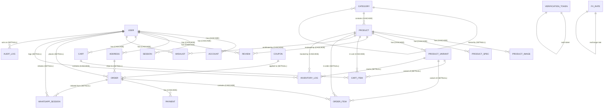

# Entity Relationship Diagram (ER)

Complete visual representation of all 22 models and their relationships.

---

## Mermaid ER Diagram



---

## Cascade & Delete Behavior

| From     | To              | Rule    |
| -------- | --------------- | ------- |
| USER     | ACCOUNT         | CASCADE |
| USER     | SESSION         | CASCADE |
| USER     | ADDRESS         | CASCADE |
| USER     | REVIEW          | CASCADE |
| USER     | ORDER           | SETNULL |
| CATEGORY | PRODUCT         | CASCADE |
| PRODUCT  | PRODUCT_IMAGE   | CASCADE |
| PRODUCT  | PRODUCT_SPEC    | CASCADE |
| PRODUCT  | PRODUCT_VARIANT | CASCADE |
| PRODUCT  | REVIEW          | CASCADE |
| PRODUCT  | ORDER_ITEM      | SETNULL |
| PRODUCT  | INVENTORY_LOG   | CASCADE |
| CART     | CART_ITEM       | CASCADE |
| ORDER    | ORDER_ITEM      | CASCADE |
| ORDER    | PAYMENT         | CASCADE |
| COUPON   | ORDER           | SETNULL |

---

## Key Indexes

### Lookup Performance

- USER.role
- CATEGORY.parentId, isActive
- PRODUCT.categoryId, isActive, isFeatured
- REVIEW.productId
- ORDER.userId, status, createdAt
- PAYMENT.orderId, status

### Uniqueness Constraints

- USER.email, phone, googleId
- ACCOUNT.(provider, providerAccountId)
- SESSION.sessionToken
- CATEGORY.slug
- PRODUCT.slug, sku
- REVIEW.(productId, userId)
- WISHLIST.(userId, productId)
- COUPON.code
- PAYMENT.(gateway, gatewayReference)

### Full-Text Search & Audit

- PRODUCT.searchVector (GIN index)
- INVENTORY_LOG.(productId, createdAt)
- AUDIT_LOG.(entityType, entityId), actorId, createdAt

---

## Immutability & Append-Only Models

| Model         | Constraint                       | Enforcement                             |
| ------------- | -------------------------------- | --------------------------------------- |
| ORDER         | Prices immutable after placement | Application layer                       |
| ORDER_ITEM    | All fields immutable             | Application layer                       |
| INVENTORY_LOG | Append-only ledger               | Database trigger                        |
| AUDIT_LOG     | Append-only trail                | Database trigger (manual migration 002) |

---

## Cardinality Summary

### One-to-Many (1:M)

- USER to ACCOUNT, SESSION, ADDRESS, REVIEW, CART, WISHLIST, ORDER, etc.
- CATEGORY to CATEGORY (self-join for hierarchy) and PRODUCT
- PRODUCT to PRODUCT_IMAGE, PRODUCT_SPEC, PRODUCT_VARIANT, REVIEW, etc.
- CART to CART_ITEM
- ORDER to ORDER_ITEM, PAYMENT, WHATSAPP_SESSION

### Optional Foreign Keys (Allow NULL)

- USER.email, phone (optional for phone-only registration)
- CATEGORY.parentId (root categories have no parent)
- CART.userId (guest carts use sessionId instead)
- ORDER.userId, shippingAddressId, couponId (preserve history on deletion)
- ORDER_ITEM.productId, variantId (preserve snapshots on deletion)
- INVENTORY_LOG.variantId, createdBy (system actions, product deletion)
- AUDIT_LOG.actorId (system actions have no actor)

---

## Domain Groupings

### Identity & Auth (5 models)

USER, ACCOUNT, SESSION, VERIFICATION_TOKEN, ADDRESS

### Catalog (6 models)

CATEGORY, PRODUCT, PRODUCT_IMAGE, PRODUCT_SPEC, PRODUCT_VARIANT, REVIEW

### Shopping (4 models)

CART, CART_ITEM, WISHLIST, COUPON

### Commerce (7 models)

ORDER, ORDER_ITEM, PAYMENT, FX_RATE, WHATSAPP_SESSION, INVENTORY_LOG, AUDIT_LOG

---

## Statistics

| Metric                     | Count |
| -------------------------- | ----- |
| Models                     | 22    |
| Enums                      | 11    |
| Foreign Keys               | 25+   |
| Unique Constraints         | 15+   |
| Indexes                    | 30+   |
| i18n Field Pairs (_en/_so) | 14    |
| Decimal Fields (USD/KES)   | 10    |
| One-to-Many Relationships  | 20+   |
| Special Patterns           | 5     |

---

## Query Patterns

### Fetch Complete Order with Items

```sql
SELECT o.*, oi.*, p.name_en, p.name_so
FROM orders o
LEFT JOIN order_items oi ON o.id = oi.order_id
LEFT JOIN products p ON oi.product_id = p.id
WHERE o.id = ?
ORDER BY oi.id;
```

### Get Product with All Media, Specs, and Variants

```sql
SELECT p.*, pi.*, ps.*, pv.*
FROM products p
LEFT JOIN product_images pi ON p.id = pi.product_id
LEFT JOIN product_specs ps ON p.id = ps.product_id
LEFT JOIN product_variants pv ON p.id = pv.product_id
WHERE p.id = ?
ORDER BY pi.position, ps.sort_order;
```

### Calculate Current Product Stock (Ledger Pattern)

```sql
SELECT SUM(delta) as current_stock
FROM inventory_logs
WHERE product_id = ? AND variant_id IS NULL;
```

### Fetch Complete Audit Trail for Entity

```sql
SELECT *
FROM audit_logs
WHERE entity_type = ? AND entity_id = ?
ORDER BY created_at DESC;
```

---

## Glossary

- **PK:** Primary Key (unique identifier)
- **FK:** Foreign Key (references another table)
- **CASCADE:** Delete child records when parent deleted
- **SETNULL:** Set FK to null when parent deleted (preserves history)
- **GENERATED:** Postgres computed column (never written by app)
- **APPEND-ONLY:** Insert-only; updates/deletes prevented by trigger
- **Immutable:** Locked after creation; update forbidden by application
- **CUID:** Collision-resistant unique ID (36 characters)
- **tsvector:** Postgres text search vector for full-text search
- **GIN:** Generalized Inverted Index (accelerates substring/phrase search)

---

## Next: Migrations & Seed Strategy

See 05-MIGRATIONS.md for migration strategy, manual migrations (FTS, audit-log trigger), and seed data.
